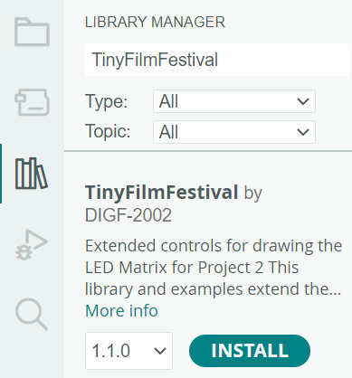
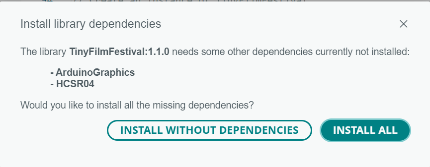
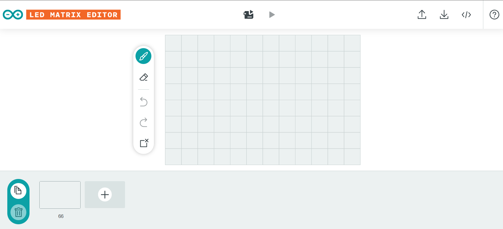

# TinyFilmFestival Library
|  |  |
|------------------------------------|------------------------------------|
|            |              |

TinyFilmFestival is a library that enables interactive media controls for animations created with the [LED Matrix Editor](https://ledmatrix-editor.arduino.cc/) and displayed on the built in LED Matrix on the Arduino UNO R4 Wifi. It mimics controls you would typically have on a media player, but allows you to build custom interfaces/interactions to the controls using sensors.

## Table of Contents
- [Features](#features)
- [Installation](#installation)
- [Creating Animations for the LED Screen](#creating-animations-for-the-led-screen)
- [Core Components](#core-components)
    - [TinyFilmFestival Class](#tinyfilmfestival-class)
    - [CombinedFilmFestival Class](#combinedfilmfestival-class)
    - [Animation Class](#animation-class)
    - [Start Animation](#StartAnimation)
    - [PlayMode Types](#playmode-types)
    - [AnimationState Types](#animationstate-types)
- [Animation Control](#animation-control)
    - [Single Animation Control](#single-animation-control)
    - [Multiple Animation Control](#multiple-animation-control)
    - [Status Functions](#status-functions)
- [Basic Examples](#basic-examples)
    - [Simple Looping Animation](#simple-looping-animation)
    - [Partial Clip Playback](#partial-clip-playback)
    - [Combined Animations](#combined-animations)
    - [Interactive Control](#interactive-control)
        - [Play/Pause Toggle](#playpause-toggle)
        - [Speed Control](#speed-control)
        - [Switch Between Animations](#switch-between-animations)
        - [Combined Animations with Button Trigger](#combined-animations-with-button-trigger)
- [Included Examples](#included-examples)
    - [Matrix Examples](#matrix-examples)
        - [BasicMatrix_01_SingleFrame](#basicmatrix_01_singleframe)
        - [BasicMatrix_02_TwoFrames](#basicmatrix_02_twoframes)
    - [Animation Playback Examples](#animation-playback-examples)
        - [AnimationPlayback_01_PlayAnimation](#animationplayback_01_playanimation)
        - [AnimationPlayback_02_PlayStates](#animationplayback_02_playstates)
        - [AnimationPlayback_03_CyclePlayStates](#animationplayback_03_cycleplaystates)
        - [AnimationPlayback_04_PlayStatesMULTI](#animationplayback_04_playstatesmulti)
        - [AnimationPlayback_05_CyclePlayStatesMULTI](#animationplayback_05_cycleplaystatesmulti)
        - [AnimationPlayback_06_PlayMultipleAtOnce](#animationplayback_06_playmultipleatonce)
    - [Button Control Examples](#button-control-examples)
        - [AnimationBUTTON_01_PlayPause](#animationbutton_01_playpause)
        - [AnimationBUTTON_02_SetSpeed](#animationbutton_02_setspeed)
        - [AnimationBUTTON_03_SwitchTrack](#animationbutton_03_switchtrack)
        - [AnimationBUTTON_04_ComboTrack](#animationbutton_04_combotrack)
    - [Pressure Sensor Examples](#pressure-sensor-examples)
        - [PressureMush_01_PlayPause](#pressuremush_01_playpause)
        - [PressureMush_02_SpeedChange](#pressuremush_02_speedchange)
        - [PressureMush_03_PressureSwap](#pressuremush_03_pressureswap)
        - [PressureMush_04_ComboTrigger](#pressuremush_04_combotrigger)
- [Documentation](#documentation)

## Features
- Frame-by-frame animation control
- Multiple playback modes (once, loop, boomerang)
- Partial clip playback (forward or backward)
- Combine multiple animations simultaneously
- Custom speed control
- Pause/resume functionality
- Animation switching

## Installation
Install the Library from the Library Manager
    
    - Search: TinyFilmFestival
    - Click Install
    - Choose "INSTALL ALL" When prompted


    




## Creating Animations for the LED Screen


This simple tool allows you to create / edit frame by frame animations and export them as code that can be read by your arduino. It allows you to simply:
- Draw which pixels are ON/OFF each frame
- Move pixels around each frame
- Change the timing of each frame

Each animation you create is downloaded as a ".h" header file that can be loaded into your main arduino code and manipulated dynamically using the methods within the TinyFilmFestival library.

- [Example Animations](exampleAnimations/)

- For full details see: [LED Matrix Editor Guide](editor-guide.md)

## Core Components

### TinyFilmFestival Class
The TinyFilmFestival class acts as a media player for LED matrix animations:

```cpp
// Basic single animation player
TinyFilmFestival player;
Animation anim1 = animation1;
Animation anim2 = animation2;

void setup() {
    player.begin();
    player.startAnimation(anim1, LOOP);  // Start with animation1
}

void loop() {
    if(someCondition) {
        player.startAnimation(anim2, LOOP);  // Swap to animation2
    }
    player.update();
}
```

Key characteristics:
- One animation track can be played at a time
- Swap animations at any time
- Independent playback control
- Must call `update()` in loop

### CombinedFilmFestival Class

The CombinedFilmFestival Class lets you merge multiple TinyFilmFestival objects into one layered animation. Each layer retains its own speed and playback control, while the combiner updates them all with a single call.

```cpp
// Create individual animation players for different layers
TinyFilmFestival background;
TinyFilmFestival foreground;
CombinedFilmFestival combined;

void setup() {
    combined.begin();

    // Set up each player separately.
    background.startAnimation(landscapeAnim, LOOP);
    background.setSpeed(100);  // Slow background animation

    foreground.startAnimation(effectAnim, LOOP);
    foreground.setSpeed(50);   // Fast foreground effect

    // The order in which films are added determines the layer stacking:
    // first added becomes the bottom layer.
    combined.addFilm(background);
    combined.addFilm(foreground);
}

void loop() {
    // Update all layers together with one call.
    combined.update();
}
```

Use CombinedFilmFestival to simplify managing multiple animation layers in your project.


### Animation Class
The Animation class wraps the frame data exported from the LED Matrix Editor into a format that can be played by TinyFilmFestival:

```cpp
// Animation from exported header file
#include "myanimation.h"
Animation myAnim = myanimation;  // Name matches header filename

// Access animation data
int totalFrames = myAnim.getFrameCount();  // Get number of frames
```
### StartAnimation
The key method for controlling animations is `startAnimation()`:

```cpp
// Start playing a full animation
film.startAnimation(myAnim, LOOP);              // Play in loop mode
film.startAnimation(myAnim, ONCE);              // Play once and stop
film.startAnimation(myAnim, BOOMERANG);         // Play forward/backward

// Play partial clips (frame numbers are 1-based)
film.startAnimation(myAnim, LOOP, 2, 6);        // Play frames 2-6 forward
film.startAnimation(myAnim, LOOP, 6, 2);        // Play frames 6-2 backward
```
### PlayMode Types
- `ONCE`: Play once and stop
- `LOOP`: Play repeatedly  
- `BOOMERANG`: Play forward/backward repeatedly

### AnimationState Types
- `IDLE`: No animation loaded
- `PLAYING`: Animation playing
- `PAUSED`: Animation paused
- `COMPLETED`: Animation finished (PLAY_ONCE mode)

## Animation Control
These functions allow to change the way in which your generated animations can be controlled by Arduino.
- These can be set one time in setup() **OR** controlled dynamically in loop()

### Single Animation Control
```cpp
TinyFilmFestival film;
Animation myAnim = animation;  // animation.h is your exported file

// Basic playback
film.startAnimation(myAnim, LOOP);             // Play full animation in loop

// Partial clip playback (frame numbers start at 1)
film.startAnimation(myAnim, LOOP, 2, 6);       // Play frames 2-6 forward
film.startAnimation(myAnim, LOOP, 6, 2);       // Play frames 6-2 backward

// Speed control
film.setSpeed(100);                            // Set frame duration to 100ms
film.restoreOriginalSpeed();                   // Return to original timing

// Playback control
film.pause();                                  // Pause animation
film.resume();                                 // Resume animation
film.stop();                                   // Stop animation completely
film.update();                                 // Update frame (call in loop)
```

### Multiple Animation Control
Combine multiple animations to play simultaneously:
```cpp
TinyFilmFestival film1, film2;                 // Create film objects
CombinedFilmFestival combinedFilm;             // Create combiner

// Setup animations
film1.startAnimation(landscapeAnim, LOOP);     // Background
film2.startAnimation(effectAnim, LOOP);        // Foreground

// Add to combiner (order matters - first = background)
combinedFilm.addFilm(film1);                   // Background layer
combinedFilm.addFilm(film2);                   // Foreground layer

// Update combined animation
combinedFilm.update();                         // Call in loop
```

### Status Functions
```cpp
// Playback status
bool isPaused();                   // Check if paused
bool isComplete();                 // Check if complete (PLAY_ONCE)
bool isPlaying();                  // Check if playing
bool isIdle();                     // Check if no animation loaded
bool isCustomSpeedActive();        // Check if using custom speed
bool isPlayingBackwards();         // Check if playing in reverse

// Current state
AnimationState getState();         // Get current state
int getCurrentFrame();             // Get current frame number (1-based)
int getCurrentSpeed();             // Get current frame duration
int getTotalFrames();             // Get total frames in animation
int getStartFrame();              // Get start frame of current clip
int getEndFrame();                // Get end frame of current clip
```

## Basic Examples

### Simple Looping Animation
```cpp
#include "TinyFilmFestival.h"
#include "animation.h"             // Your exported animation file

TinyFilmFestival film;
Animation myAnimation = animation;  // Name matches header file

void setup() {
    film.begin();
    film.startAnimation(myAnimation, LOOP);
}

void loop() {
    film.update();
}
```

### Partial Clip Playback
```cpp
#include "TinyFilmFestival.h"
#include "animation.h"

TinyFilmFestival film;
Animation myAnimation = animation;

void setup() {
    film.begin();
    // Play frames 2-6 forward in a loop
    film.startAnimation(myAnimation, LOOP, 2, 6);
    // Or play frames 6-2 backward in a loop
    //film.startAnimation(myAnimation, LOOP, 6, 2);
}

void loop() {
    film.update();
}
```

### Combined Animations
```cpp
#include "TinyFilmFestival.h"
#include "landscape.h"
#include "effect.h"

TinyFilmFestival background, effect;
CombinedFilmFestival combined;

Animation landscapeAnim = landscape;
Animation effectAnim = effect;

void setup() {
    combined.begin();
    
    // Setup animations
    background.startAnimation(landscapeAnim, LOOP);
    effect.startAnimation(effectAnim, LOOP);
    
    // Add to combiner (background first)
    combined.addFilm(background);
    combined.addFilm(effect);
}

void loop() {
    combined.update();
}
```
### Interactive Control

These examples show different ways to control animations using a button. All examples use a button connected between pin 2 and ground with the internal pullup resistor enabled.

#### Play/Pause Toggle
```cpp
#include "TinyFilmFestival.h"
#include "animation.h"

TinyFilmFestival film;
Animation myAnimation = animation;

const int buttonPin = 2;
boolean buttonState;

void setup() {
    film.begin();
    pinMode(buttonPin, INPUT_PULLUP);
    film.startAnimation(myAnimation, LOOP);
}

void loop() {
    buttonState = digitalRead(buttonPin);
    
    if (buttonState == LOW) {
        film.pause();
    } else {
        film.resume();
    }
    
    film.update();
}
```

#### Speed Control
```cpp
#include "TinyFilmFestival.h"
#include "animation.h"

TinyFilmFestival film;
Animation myAnimation = animation;

const int buttonPin = 2;
boolean buttonState;

// Speed settings
const int SPEED_FAST = 50;   // 50ms per frame
const int SPEED_SLOW = 200;  // 200ms per frame

void setup() {
    film.begin();
    pinMode(buttonPin, INPUT_PULLUP);
    film.startAnimation(myAnimation, LOOP);
}

void loop() {
    buttonState = digitalRead(buttonPin);
    
    if (buttonState == LOW) {
        film.setSpeed(SPEED_FAST);
    } else {
        film.setSpeed(SPEED_SLOW);
    }
    
    film.update();
}
```

#### Switch Between Animations
```cpp
#include "TinyFilmFestival.h"
#include "idle.h"
#include "active.h"

TinyFilmFestival film;
Animation idleAnim = idle;
Animation activeAnim = active;

const int buttonPin = 2;
boolean buttonState;

void setup() {
    film.begin();
    pinMode(buttonPin, INPUT_PULLUP);
    film.startAnimation(idleAnim, LOOP);
}

void loop() {
    buttonState = digitalRead(buttonPin);
    
    if (buttonState == LOW) {
        film.startAnimation(activeAnim, LOOP);
    } else {
        film.startAnimation(idleAnim, LOOP);
    }
    
    film.update();
}
```

#### Combined Animations with Button Trigger
```cpp
#include "TinyFilmFestival.h"
#include "background.h"
#include "effect.h"

// Create film objects for each animation
TinyFilmFestival backgroundFilm;
TinyFilmFestival effectFilm;
CombinedFilmFestival combinedFilm;

// Create animations
Animation backgroundAnim = background;
Animation effectAnim = effect;

const int buttonPin = 2;
boolean buttonState;

void setup() {
    combinedFilm.begin();
    pinMode(buttonPin, INPUT_PULLUP);
    
    // Setup continuous background
    backgroundFilm.startAnimation(backgroundAnim, LOOP);
    backgroundFilm.setSpeed(100);
    
    // Setup effect (starts stopped)
    effectFilm.startAnimation(effectAnim, LOOP);
    effectFilm.setSpeed(50);
    effectFilm.stop();
    
    // Add to combiner (background first)
    combinedFilm.addFilm(backgroundFilm);
    combinedFilm.addFilm(effectFilm);
}

void loop() {
    buttonState = digitalRead(buttonPin);
    
    if (buttonState == LOW) {
        effectFilm.startAnimation(effectAnim, LOOP);
    } else {
        effectFilm.stop();
    }
    
    combinedFilm.update();
}
```
Each example shows a different approach to interactive control:
- Play/Pause: Simple toggle between playing and paused states
- Speed Control: Switch between different playback speeds
- Animation Switch: Change between two different animations
- Combined Animations: Run a background animation with a button-triggered overlay effect

## Included Examples

These can be found in File -> Examples -> TinyFilmFestival

### Basic Matrix Examples
Simple examples demonstrating fundamental LED matrix control:


#### [BasicMatrix_01_SingleFrame](/examples/Basic%20Matrix/BasicMatrix_01_singleFrame/BasicMatrix_01_SingleFrame.ino)
- Static pattern display on LED matrix  
- Uses `ArduinoLEDMatrix` class directly  
- 8x12 grid of binary values (0=off, 1=on)  
- Simple `renderBitmap()` call to display pattern

#### [BasicMatrix_02_TwoFrames](/examples/Basic%20Matrix/BasicMatrix_02_twoFrames/BasicMatrix_02_TwoFrames.ino)
- Basic animation using frame alternation  
- Manual timing control with `delay()`  
- Two patterns: heart and smiley face  
- Demonstrates frame buffer structure

### Animation Playback Examples
Core animation control demonstrations:

#### [AnimationPlayback_01_PlayAnimation](/examples/Animation%20Playback/AnimationPlayback_01_PlayAnimation/AnimationPlayback_01_PlayAnimation.ino)
- Basic animation setup and playback  
- Multiple playback modes (`ONCE`, `LOOP`, `BOOMERANG`)  
- Speed control with `setSpeed()` and `restoreOriginalSpeed()`  
- Status checking methods

#### [AnimationPlayback_02_PlayStates](/examples/Animation%20Playback/AnimationPlayback_02_PlayStates/AnimationPlayback_02_PlayStates.ino)
- Different animation states (normal, fast, slow) 
- Variable-based state selection  
- Multiple playback modes per state  
- Custom speed settings

#### [AnimationPlayback_03_CyclePlayStates](/examples/Animation%20Playback/AnimationPlayback_03_CyclePlayStates/AnimationPlayback_03_CyclePlayStates.ino)
- Automated 5-state cycling  
- Timer-based transitions (5 seconds each)  
- Different speeds and modes per state  
- Serial feedback for state tracking

#### [AnimationPlayback_04_PlayStatesMULTI](/examples/Animation%20Playback/AnimationPlayback_04_PlayStatesMULTI/AnimationPlayback_04_PlayStatesMULTI.ino)
- Multiple animation switching  
- Boolean flag control  
- Two animations: idle and go  
- Independent animation objects

#### [AnimationPlayback_05_CyclePlayStatesMULTI](/examples/Animation%20Playback/AnimationPlayback_05_CyclePlayStatesMULTI/AnimationPlayback_05_CyclePlayStatesMULTI.ino)
- Complex state machine with multiple animations  
- 5 different states with timing  
- Alternating between idle and go animations  
- Different parameters per state

#### [AnimationPlayback_06_PlayMultipleAtOnce](/examples/Animation%20Playback/AnimationPlayback_06_PlayMultipleAtOnce/AnimationPlayback_06_PlayMultipleAtOnce.ino)
- `CombinedFilmFestival` usage  
- Background/foreground layering  
- Independent speed control  
- Layer management

### Button Control Examples
Interactive hardware control demonstrations:

#### [AnimationBUTTON_01_PlayPause](/examples/Animation%20Control%20BUTTON/AnimationBUTTON_01_PlayPause/AnimationBUTTON_01_PlayPause.ino)
- Simple play/pause toggle  animation
- Button debouncing  
- Internal state tracking  
- Serial feedback

#### [AnimationBUTTON_02_SetSpeed](/examples/Animation%20Control%20BUTTON/AnimationBUTTON_02_SetSpeed/AnimationBUTTON_02_SetSpeed.ino)
- Fast/slow speed toggling  animation 
- Custom speed settings  
- Button input handling  
- Speed state management

#### [AnimationBUTTON_03_SwitchTrack](/examples/Animation%20Control%20BUTTON/AnimationBUTTON_03_SwitchTrack/AnimationBUTTON_03_SwitchTrack.ino)
- Animation switching with button  animation 
- Two different animations  
- Real-time switching  
- Clean transition handling

#### [AnimationBUTTON_04_ComboTrack](/examples/Animation%20Control%20BUTTON/AnimationBUTTON_04_ComboTrack/AnimationBUTTON_04_ComboTrack.ino)
- Combined animations with button trigger  
- Background/foreground system  
- Button-triggered overlay effects  
- Layer management with `CombinedFilmFestival`

### Pressure Sensor Examples
Interactive control using analog pressure sensor input:

#### [PressureMush_01_PlayPause](/examples/Animation%20Control%20Pressure%20Mush/PressureMush_01_PlayPause/PressureMush_01_PlayPause.ino)
- Pressure-based play/pause control  
- Analog threshold detection  
- Serial pressure monitoring  
- Simple state toggling based on pressure

#### [PressureMush_02_SpeedChange](/examples/Animation%20Control%20Pressure%20Mush/PressureMush_02_SpeedChange/PressureMush_02_SpeedChange.ino)
- Dynamic speed control via pressure  
- Maps pressure (0-1023) to speed (50-300ms)  
- Continuous analog reading  
- Real-time speed adjustments

#### [PressureMush_03_PressureSwap](/examples/Animation%20Control%20Pressure%20Mush/PressureMush_03_PressureSwap/PressureMush_03_PressureSwap.ino)
- Pressure threshold animation switching  
- Two animations: idle and go states  
- Clean transitions between animations  
- Demonstrates simple pressure-based state machine

#### [PressureMush_04_ComboTrigger](/examples/Animation%20Control%20Pressure%20Mush/PressureMush_04_ComboTrigger/PressureMush_04_ComboTrigger.ino)
- Pressure-activated overlay effects  
- Continuous background animation  
- Pressure-triggered foreground effects  
- Layer management with `CombinedFilmFestival`


