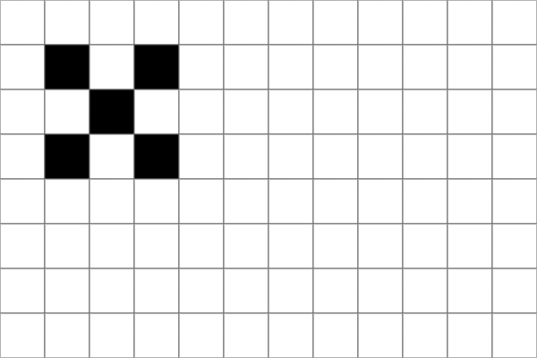

# TinyFilmFestival

|  |  |
|------------------------------------|------------------------------------|
|            |              |

A library for creating animated displays on the Arduino UNO R4 WiFi's built-in 12×8 LED Matrix. TinyFilmFestival offers **two complementary approaches** to bring your matrix to life:

| Animation Mode | Canvas Mode |
|----------------|-------------|
| Pre-made frames from [LED Matrix Editor](https://ledmatrix-editor.arduino.cc/) | Code-generated graphics in real-time |
| `play()`, `pause()`, `setSpeed()` | `beginDraw()`, `point()`, `circle()` |
| Great for detailed art & characters | Great for dynamic data & effects |

**Both modes can be combined** — draw code-based overlays on top of playing animations with `beginOverlay()`.

---

## Quick Start

### Animation Mode (30 seconds)
```cpp
#include "TinyFilmFestival.h"
#include "animation.h"          // From LED Matrix Editor

TinyScreen screen;
Animation myAnim = animation;

void setup() {
    screen.begin();
    screen.play(myAnim, LOOP);
}

void loop() {
    screen.update();
}
```

### Canvas Mode (30 seconds)
```cpp
#include "TinyFilmFestival.h"

TinyScreen screen;
int x = 0;

void setup() {
    screen.begin();
}

void loop() {
    screen.beginDraw();
    screen.clear();
    screen.point(x, 4);
    screen.endDraw();
    
    x = (x + 1) % 12;
    delay(100);
}
```

---

## Installation

1. Open Arduino IDE → **Sketch** → **Include Library** → **Manage Libraries**
2. Search: `TinyFilmFestival`
3. Click **Install** → Choose **INSTALL ALL** when prompted


---

## Two Modes, One Canvas

### Animation Mode
Pre-made frame-by-frame animations created in the [LED Matrix Editor](https://ledmatrix-editor.arduino.cc/). Think of it like a video player:

- **LOOP** — Play continuously
- **ONCE** — Play once and stop
- **BOOMERANG** — Play forward, then backward

```cpp
screen.play(myAnim, LOOP);              // Play forever
screen.play(myAnim, ONCE);              // Play once
screen.play(myAnim, BOOMERANG);         // Ping-pong

screen.setSpeed(50);                    // Faster (50ms/frame)
screen.pause();                         // Pause playback
screen.resume();                        // Resume playback
```

### Canvas Mode
Draw directly with code using graphics primitives. Create motion through code logic:

```cpp
screen.beginDraw();
screen.clear();
screen.point(x, y);                     // Single pixel
screen.line(0, 0, 11, 7);               // Diagonal line
screen.rect(2, 1, 8, 5);                // Rectangle outline
screen.circle(6, 4, 3);                 // Circle
screen.endDraw();
```

### Hybrid Mode
Combine both — play an animation and draw on top of it:

```cpp
// In loop():
screen.update();                        // Update animation frame

screen.beginOverlay();
// Animation is already rendered, now add overlay
screen.line(0, indicatorY, 11, indicatorY);  // Draw indicator bar
screen.endOverlay();
```

---

## Creating Animations

Use the [LED Matrix Editor](https://ledmatrix-editor.arduino.cc/) to create `.h` animation files:

1. Draw pixels frame-by-frame
2. Set timing for each frame
3. Export as `.h` file
4. Add to your Arduino sketch folder

See [editor-guide.md](editor-guide.md) for detailed instructions.  
Pre-made animations: [exampleAnimations/](exampleAnimations/)

---

## API Reference

### TinyScreen Class

```cpp
TinyScreen screen;
Animation myAnim = animation;           // From .h file

// Setup
screen.begin();                         // Initialize matrix

// Playback
screen.play(myAnim, LOOP);              // Start animation
screen.play(myAnim, LOOP, 2, 6);        // Play frames 2-6 only
screen.pause();                         // Pause
screen.resume();                        // Resume
screen.stop();                          // Stop completely
screen.update();                        // Update frame (call in loop!)

// Speed
screen.setSpeed(100);                   // Set ms per frame
screen.restoreOriginalSpeed();          // Return to original timing

// Status
screen.isPlaying();                     // Currently playing?
screen.isPaused();                      // Currently paused?
screen.isComplete();                    // Finished (ONCE mode)?
screen.getCurrentFrame();               // Current frame number
```

### Layered Animations
Stack multiple animations together (up to 4 layers):

```cpp
TinyScreen screen;

screen.begin();
screen.addLayer();                      // Add layer 1
screen.addLayer();                      // Add layer 2

screen.play(bgAnim, LOOP);              // Layer 0 (default)
screen.playOnLayer(1, fgAnim, LOOP);    // Layer 1

// Control individual layers
screen.setSpeedOnLayer(1, 50);
screen.pauseOnLayer(1);
screen.resumeOnLayer(1);

// In loop:
screen.update();
```

### Canvas Drawing
All drawing methods are built into TinyScreen:

```cpp
screen.beginDraw();                     // Start fresh frame
screen.clear();

screen.point(x, y);                     // Single pixel
screen.line(x1, y1, x2, y2);            // Line
screen.rect(x, y, w, h);                // Rectangle
screen.circle(cx, cy, r);               // Circle
screen.text("Hi", x, y);                // Text (needs font)

screen.endDraw();
```

### Hybrid Mode (Overlays)
Draw on top of a running animation:

```cpp
screen.update();                        // Update animation

screen.beginOverlay();                  // Start overlay (preserves animation)
screen.point(x, y);                     // Add drawn elements
screen.endOverlay();                    // Commit overlay
```

---

## Examples

Find these in **File → Examples → TinyFilmFestival**

### 01_Basics
| Example | Description |
|---------|-------------|
| **FirstAnimation** | Simplest Animation Mode example — load and play |
| **FirstCanvas** | Simplest Canvas Mode example — bouncing dot |

### 02_Animation_Mode
| Example | Description |
|---------|-------------|
| **PlaybackControl** | All playback modes (LOOP/ONCE/BOOMERANG), speed control, partial clips |
| **LayeredAnimations** | Multiple animations combined with addLayer() and playOnLayer() |

### 03_Canvas_Mode
| Example | Description |
|---------|-------------|
| **MovingShapes** | Motion patterns mirroring animation modes (continuous, single-pass, bounce) |
| **LayeredGraphics** | Multiple independent animated elements drawn in layers |

### 04_Hybrid_Mode
| Example | Description |
|---------|-------------|
| **AnimationWithOverlay** | Pre-made animation with code-drawn progress indicator |

### 05_Sensor_Control
| Example | Description |
|---------|-------------|
| **Button_PlayPause** | Toggle animation play/pause with button |
| **Button_ContentSwitch** | Switch between animations based on button state |
| **Distance_SpeedControl** | Control animation speed with ultrasonic sensor |
| **Distance_ZoneSwitch** | Switch animations based on proximity zones |
| **Pressure_SpeedControl** | Control animation speed with pressure sensor |

### 06_Projects
| Example | Description |
|---------|-------------|
| **InteractiveCharacter** | Complete project: 4-zone proximity character with sparkle effects |

---

## Hardware

**Required:**
- Arduino UNO R4 WiFi (has built-in 12×8 LED Matrix)

**Optional (for sensor examples):**
- Pushbutton (connect between pin 2 and GND)
- HC-SR04 ultrasonic sensor (Trigger: A0, Echo: A1)
- Pressure/force sensor (analog input A0)

---

## Documentation

- [LED Matrix Editor Guide](editor-guide.md) — Creating animation files
- [ArduinoGraphics Reference](ArduinoGraphics_R4.md) — Canvas Mode API details
- [Example Animations](exampleAnimations/) — Pre-made `.h` files to use

---

## License

MIT License — see [LICENSE](LICENSE)
