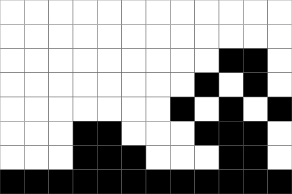

# TinyFilmFestival Library
|  |  |
|------------------------------------|------------------------------------|
|            |              |

TinyFilmFestival is a library that enables interactive media controls for animations created with the [LED Matrix Editor](https://ledmatrix-editor.arduino.cc/) and displayed on the built in LED Matrix on the Arduino UNO R4 Wifi. It mimics controls you would typically have on a media player, but allows you to build custom interfaces/interactions to the controls using sensors.

## Table of Contents
- [Features](#features)
- [Installation](#installation)
- [Creating Animations for the LED Screen](#creating-animations-for-the-led-screen)
- [Core Components](#core-components)
    - [Animation Class](#animation-class)
    - [PlayMode Types](#playmode-types)
    - [AnimationState Types](#animationstate-types)
- [Animation Control](#animation-control)
    - [Single Animation Control](#single-animation-control)
    - [Multiple Animation Control](#multiple-animation-control)
    - [Status Functions](#status-functions)
- [Basic Examples](#basic-examples)
    - [Simple Looping Animation](#simple-looping-animation)
    - [Partial Clip Playback](#partial-clip-playback)
    - [Combined Animations](#combined-animations)
    - [Interactive Control](#interactive-control)
        - [Play/Pause Toggle](#playpause-toggle)
        - [Speed Control](#speed-control)
        - [Switch Between Animations](#switch-between-animations)
        - [Combined Animations with Button Trigger](#combined-animations-with-button-trigger)
- [Included Examples](#included-examples)
    - [Basic Matrix Examples](#basic-matrix-examples)
        - [BasicMatrix_01_SingleFrame](#basicmatrix_01_singleframe)
        - [BasicMatrix_02_TwoFrames](#basicmatrix_02_twoframes)
    - [Animation Playback Examples](#animation-playback-examples)
        - [AnimationPlayback_01_PlayAnimation](#animationplayback_01_playanimation)
        - [AnimationPlayback_02_PlayStates](#animationplayback_02_playstates)
        - [AnimationPlayback_03_CyclePlayStates](#animationplayback_03_cycleplaystates)
        - [AnimationPlayback_04_PlayStatesMULTI](#animationplayback_04_playstatesmulti)
        - [AnimationPlayback_05_CyclePlayStatesMULTI](#animationplayback_05_cycleplaystatesmulti)
        - [AnimationPlayback_06_PlayMultipleAtOnce](#animationplayback_06_playmultipleatonce)
    - [Button Control Examples](#button-control-examples)
        - [AnimationBUTTON_01_PlayPause](#animationbutton_01_playpause)
        - [AnimationBUTTON_02_SetSpeed](#animationbutton_02_setspeed)
        - [AnimationBUTTON_03_SwitchTrack](#animationbutton_03_switchtrack)
        - [AnimationBUTTON_04_ComboTrack](#animationbutton_04_combotrack)
- [Documentation](#documentation)

## Features
- Frame-by-frame animation control
- Multiple playback modes (once, loop, boomerang)
- Partial clip playback (forward or backward)
- Combine multiple animations simultaneously
- Custom speed control
- Pause/resume functionality
- Button input integration
- Animation switching

## Installation
1. Install the Library from the Library Manager
    
    - Search: TinyFilmFestival
    - Click Install
    - Choose "Install with Depencies" When prompted
    
2. Include in sketch: `#include "TinyFilmFestival.h"`

## Creating Animations for the LED Screen


This simple tool allows you to create / edit frame by frame animations and export them as code that can be read by your arduino. It allows you to simply:
- Draw which pixels are ON/OFF each frame
- Move pixels around each frame
- Change the timing of each frame

Each animation you create is downloaded as a ".h" header file that can be loaded into your main arduino code and manipulated dynamically using the methods within the TinyFilmFestival library.

For full details see: [LED Matrix Editor Guide](editor-guide.md)

## Core Components

### Animation Class
The Animation class is automatically created from your exported header file:
```cpp
// If your exported file is named "myanimation.h":
#include "myanimation.h"
Animation myAnim = myanimation;  // Variable name matches header filename
```

### PlayMode Types
- `ONCE`: Play once and stop
- `LOOP`: Play repeatedly  
- `BOOMERANG`: Play forward/backward repeatedly

### AnimationState Types
- `IDLE`: No animation loaded
- `PLAYING`: Animation playing
- `PAUSED`: Animation paused
- `COMPLETED`: Animation finished (PLAY_ONCE mode)

## Animation Control

### Single Animation Control
```cpp
TinyFilmFestival film;
Animation myAnim = animation;  // animation.h is your exported file

// Basic playback
film.startAnimation(myAnim, LOOP);             // Play full animation in loop

// Partial clip playback (frame numbers start at 1)
film.startAnimation(myAnim, LOOP, 2, 6);       // Play frames 2-6 forward
film.startAnimation(myAnim, LOOP, 6, 2);       // Play frames 6-2 backward

// Speed control
film.setSpeed(100);                            // Set frame duration to 100ms
film.restoreOriginalSpeed();                   // Return to original timing

// Playback control
film.pause();                                  // Pause animation
film.resume();                                 // Resume animation
film.stop();                                   // Stop animation completely
film.update();                                 // Update frame (call in loop)
```

### Multiple Animation Control
Combine multiple animations to play simultaneously:
```cpp
TinyFilmFestival film1, film2;                 // Create film objects
CombinedFilmFestival combinedFilm;             // Create combiner

// Setup animations
film1.startAnimation(landscapeAnim, LOOP);     // Background
film2.startAnimation(effectAnim, LOOP);        // Foreground

// Add to combiner (order matters - first = background)
combinedFilm.addFilm(film1);                   // Background layer
combinedFilm.addFilm(film2);                   // Foreground layer

// Update combined animation
combinedFilm.update();                         // Call in loop
```

### Status Functions
```cpp
// Playback status
bool isPaused();                   // Check if paused
bool isComplete();                 // Check if complete (PLAY_ONCE)
bool isPlaying();                  // Check if playing
bool isIdle();                     // Check if no animation loaded
bool isCustomSpeedActive();        // Check if using custom speed
bool isPlayingBackwards();         // Check if playing in reverse

// Current state
AnimationState getState();         // Get current state
int getCurrentFrame();             // Get current frame number (1-based)
int getCurrentSpeed();             // Get current frame duration
int getTotalFrames();             // Get total frames in animation
int getStartFrame();              // Get start frame of current clip
int getEndFrame();                // Get end frame of current clip
```

## Basic Examples

### Simple Looping Animation
```cpp
#include "TinyFilmFestival.h"
#include "animation.h"             // Your exported animation file

TinyFilmFestival film;
Animation myAnimation = animation;  // Name matches header file

void setup() {
    film.begin();
    film.startAnimation(myAnimation, LOOP);
}

void loop() {
    film.update();
}
```

### Partial Clip Playback
```cpp
#include "TinyFilmFestival.h"
#include "animation.h"

TinyFilmFestival film;
Animation myAnimation = animation;

void setup() {
    film.begin();
    // Play frames 2-6 forward in a loop
    film.startAnimation(myAnimation, LOOP, 2, 6);
    // Or play frames 6-2 backward in a loop
    //film.startAnimation(myAnimation, LOOP, 6, 2);
}

void loop() {
    film.update();
}
```

### Combined Animations
```cpp
#include "TinyFilmFestival.h"
#include "landscape.h"
#include "effect.h"

TinyFilmFestival background, effect;
CombinedFilmFestival combined;

Animation landscapeAnim = landscape;
Animation effectAnim = effect;

void setup() {
    combined.begin();
    
    // Setup animations
    background.startAnimation(landscapeAnim, LOOP);
    effect.startAnimation(effectAnim, LOOP);
    
    // Add to combiner (background first)
    combined.addFilm(background);
    combined.addFilm(effect);
}

void loop() {
    combined.update();
}
```
### Interactive Control

These examples show different ways to control animations using a button. All examples use a button connected between pin 2 and ground with the internal pullup resistor enabled.

#### Play/Pause Toggle
```cpp
#include "TinyFilmFestival.h"
#include "animation.h"

TinyFilmFestival film;
Animation myAnimation = animation;

const int buttonPin = 2;
boolean buttonState;

void setup() {
    film.begin();
    pinMode(buttonPin, INPUT_PULLUP);
    film.startAnimation(myAnimation, LOOP);
}

void loop() {
    buttonState = digitalRead(buttonPin);
    
    if (buttonState == LOW) {
        film.pause();
    } else {
        film.resume();
    }
    
    film.update();
}
```

#### Speed Control
```cpp
#include "TinyFilmFestival.h"
#include "animation.h"

TinyFilmFestival film;
Animation myAnimation = animation;

const int buttonPin = 2;
boolean buttonState;

// Speed settings
const int SPEED_FAST = 50;   // 50ms per frame
const int SPEED_SLOW = 200;  // 200ms per frame

void setup() {
    film.begin();
    pinMode(buttonPin, INPUT_PULLUP);
    film.startAnimation(myAnimation, LOOP);
}

void loop() {
    buttonState = digitalRead(buttonPin);
    
    if (buttonState == LOW) {
        film.setSpeed(SPEED_FAST);
    } else {
        film.setSpeed(SPEED_SLOW);
    }
    
    film.update();
}
```

#### Switch Between Animations
```cpp
#include "TinyFilmFestival.h"
#include "idle.h"
#include "active.h"

TinyFilmFestival film;
Animation idleAnim = idle;
Animation activeAnim = active;

const int buttonPin = 2;
boolean buttonState;

void setup() {
    film.begin();
    pinMode(buttonPin, INPUT_PULLUP);
    film.startAnimation(idleAnim, LOOP);
}

void loop() {
    buttonState = digitalRead(buttonPin);
    
    if (buttonState == LOW) {
        film.startAnimation(activeAnim, LOOP);
    } else {
        film.startAnimation(idleAnim, LOOP);
    }
    
    film.update();
}
```

#### Combined Animations with Button Trigger
```cpp
#include "TinyFilmFestival.h"
#include "background.h"
#include "effect.h"

// Create film objects for each animation
TinyFilmFestival backgroundFilm;
TinyFilmFestival effectFilm;
CombinedFilmFestival combinedFilm;

// Create animations
Animation backgroundAnim = background;
Animation effectAnim = effect;

const int buttonPin = 2;
boolean buttonState;

void setup() {
    combinedFilm.begin();
    pinMode(buttonPin, INPUT_PULLUP);
    
    // Setup continuous background
    backgroundFilm.startAnimation(backgroundAnim, LOOP);
    backgroundFilm.setSpeed(100);
    
    // Setup effect (starts stopped)
    effectFilm.startAnimation(effectAnim, LOOP);
    effectFilm.setSpeed(50);
    effectFilm.stop();
    
    // Add to combiner (background first)
    combinedFilm.addFilm(backgroundFilm);
    combinedFilm.addFilm(effectFilm);
}

void loop() {
    buttonState = digitalRead(buttonPin);
    
    if (buttonState == LOW) {
        effectFilm.startAnimation(effectAnim, LOOP);
    } else {
        effectFilm.stop();
    }
    
    combinedFilm.update();
}
```
Each example shows a different approach to interactive control:
- Play/Pause: Simple toggle between playing and paused states
- Speed Control: Switch between different playback speeds
- Animation Switch: Change between two different animations
- Combined Animations: Run a background animation with a button-triggered overlay effect

## Included Examples

These can be found in File -> Examples -> TinyFilmFestival

### Basic Matrix Examples
Simple examples demonstrating fundamental LED matrix control:

#### BasicMatrix_01_SingleFrame
- Static pattern display on LED matrix
- Uses `ArduinoLEDMatrix` class directly
- 8x12 grid of binary values (0=off, 1=on)
- Simple `renderBitmap()` call to display pattern

#### BasicMatrix_02_TwoFrames  
- Basic animation using frame alternation
- Manual timing control with `delay()`
- Two patterns: heart and smiley face
- Demonstrates frame buffer structure

### Animation Playback Examples
Core animation control demonstrations:

#### AnimationPlayback_01_PlayAnimation
- Basic animation setup and playback
- Multiple playback modes (`ONCE`, `LOOP`, `BOOMERANG`)
- Speed control with `setSpeed()` and `restoreOriginalSpeed()`
- Status checking methods

#### AnimationPlayback_02_PlayStates
- Different animation states (normal, fast, slow)
- Variable-based state selection
- Multiple playback modes per state
- Custom speed settings

#### AnimationPlayback_03_CyclePlayStates
- Automated 5-state cycling
- Timer-based transitions (5 seconds each)
- Different speeds and modes per state
- Serial feedback for state tracking

#### AnimationPlayback_04_PlayStatesMULTI
- Multiple animation switching
- Boolean flag control
- Two animations: idle and go
- Independent animation objects

#### AnimationPlayback_05_CyclePlayStatesMULTI
- Complex state machine with multiple animations
- 5 different states with timing
- Alternating between idle and go animations
- Different parameters per state

#### AnimationPlayback_06_PlayMultipleAtOnce
- `CombinedFilmFestival` usage
- Background/foreground layering
- Independent speed control
- Layer management

### Button Control Examples
Interactive hardware control demonstrations:

#### AnimationBUTTON_01_PlayPause
- Simple play/pause toggle
- Button debouncing
- Internal state tracking
- Serial feedback

#### AnimationBUTTON_02_SetSpeed
- Fast/slow speed toggling
- Custom speed settings
- Button input handling
- Speed state management

#### AnimationBUTTON_03_SwitchTrack
- Animation switching with button
- Two different animations
- Real-time switching
- Clean transition handling

#### AnimationBUTTON_04_ComboTrack
- Combined animations with button trigger
- Background/foreground system
- Button-triggered overlay effects
- Layer management with `CombinedFilmFestival`


## Documentation
- [LED Matrix Editor Guide](editor-guide.md)
- [Basic Matrix Examples](basic-matrix.md)
- [Animation Control Examples](animation-control.md) 
- [Button Control Examples](button-control.md)
