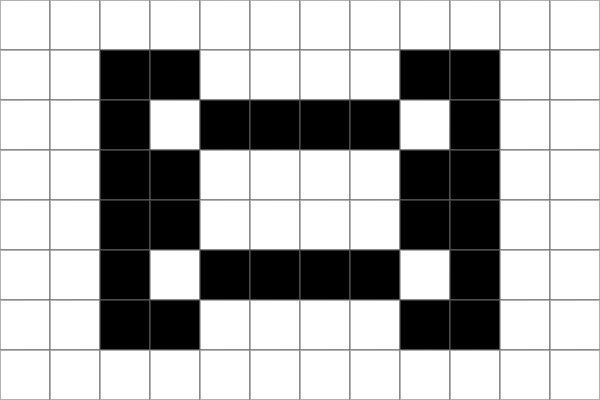

# TinyFilmFestival

|  |  |
|------------------------------------|------------------------------------|
|            |              |

A library for creating animated displays on the Arduino UNO R4 WiFi's built-in 12×8 LED Matrix. TinyFilmFestival offers **two complementary approaches** to bring your matrix to life:

| Animation Mode | Canvas Mode |
|----------------|-------------|
| Pre-made frames from [LED Matrix Editor](https://ledmatrix-editor.arduino.cc/) | Code-generated graphics in real-time |
| `startAnimation()`, `pause()`, `setSpeed()` | `beginDraw()`, `point()`, `circle()` |
| Great for detailed art & characters | Great for dynamic data & effects |

**Both modes can be combined** — draw code-based overlays on top of playing animations.

---

## Quick Start

### Animation Mode (30 seconds)
```cpp
#include "TinyFilmFestival.h"
#include "animation.h"          // From LED Matrix Editor

TinyFilmFestival film;
Animation myAnim = animation;

void setup() {
    film.begin();
    film.startAnimation(myAnim, LOOP);
}

void loop() {
    film.update();
}
```

### Canvas Mode (30 seconds)
```cpp
#include "Arduino_LED_Matrix.h"
#include "ArduinoGraphics.h"

ArduinoLEDMatrix matrix;
int x = 0;

void setup() {
    matrix.begin();
}

void loop() {
    matrix.beginDraw();
    matrix.clear();
    matrix.point(x, 4);
    matrix.endDraw();
    
    x = (x + 1) % 12;
    delay(100);
}
```

---

## Installation

1. Open Arduino IDE → **Sketch** → **Include Library** → **Manage Libraries**
2. Search: `TinyFilmFestival`
3. Click **Install** → Choose **INSTALL ALL** when prompted


---

## Two Modes, One Canvas

### Animation Mode
Pre-made frame-by-frame animations created in the [LED Matrix Editor](https://ledmatrix-editor.arduino.cc/). Think of it like a video player:

- **LOOP** — Play continuously
- **ONCE** — Play once and stop
- **BOOMERANG** — Play forward, then backward

```cpp
film.startAnimation(myAnim, LOOP);      // Play forever
film.startAnimation(myAnim, ONCE);      // Play once
film.startAnimation(myAnim, BOOMERANG); // Ping-pong

film.setSpeed(50);                      // Faster (50ms/frame)
film.pause();                           // Pause playback
film.resume();                          // Resume playback
```

### Canvas Mode
Draw directly with code using ArduinoGraphics primitives. Create motion through code logic:

```cpp
matrix.beginDraw();
matrix.clear();
matrix.point(x, y);                     // Single pixel
matrix.line(0, 0, 11, 7);               // Diagonal line
matrix.rect(2, 1, 8, 5);                // Rectangle outline
matrix.circle(6, 4, 3);                 // Circle
matrix.endDraw();
```

### Hybrid Mode
Combine both — play an animation and draw on top of it:

```cpp
// In loop():
film.update();                          // Update animation frame

matrix.beginDraw();
// Animation is already rendered, now add overlay
matrix.line(0, indicatorY, 11, indicatorY);  // Draw indicator bar
matrix.endDraw();
```

---

## Creating Animations

Use the [LED Matrix Editor](https://ledmatrix-editor.arduino.cc/) to create `.h` animation files:

1. Draw pixels frame-by-frame
2. Set timing for each frame
3. Export as `.h` file
4. Add to your Arduino sketch folder

See [editor-guide.md](editor-guide.md) for detailed instructions.  
Pre-made animations: [exampleAnimations/](exampleAnimations/)

---

## API Reference

### TinyFilmFestival Class

```cpp
TinyFilmFestival film;
Animation myAnim = animation;           // From .h file

// Setup
film.begin();                           // Initialize matrix

// Playback
film.startAnimation(myAnim, LOOP);      // Start animation
film.startAnimation(myAnim, LOOP, 2, 6);// Play frames 2-6 only
film.pause();                           // Pause
film.resume();                          // Resume
film.stop();                            // Stop completely
film.update();                          // Update frame (call in loop!)

// Speed
film.setSpeed(100);                     // Set ms per frame
film.restoreOriginalSpeed();            // Return to original timing

// Status
film.isPlaying();                       // Currently playing?
film.isPaused();                        // Currently paused?
film.isComplete();                      // Finished (ONCE mode)?
film.getCurrentFrame();                 // Current frame number
```

### CombinedFilmFestival Class
Layer multiple animations together:

```cpp
TinyFilmFestival bg, fg;
CombinedFilmFestival combined;

combined.begin();

bg.startAnimation(landscapeAnim, LOOP);
fg.startAnimation(effectAnim, BOOMERANG);

combined.addFilm(bg);                   // Background (added first)
combined.addFilm(fg);                   // Foreground (added last)

// In loop:
combined.update();
```

### ArduinoGraphics (Canvas Mode)
Built into the Arduino UNO R4 WiFi board package:

```cpp
ArduinoLEDMatrix matrix;

matrix.begin();
matrix.beginDraw();
matrix.clear();

matrix.point(x, y);                     // Single pixel
matrix.line(x1, y1, x2, y2);            // Line
matrix.rect(x, y, w, h);                // Rectangle
matrix.circle(cx, cy, r);               // Circle
matrix.text("Hi", x, y);                // Text (needs font)

matrix.endDraw();
```

---

## Examples

Find these in **File → Examples → TinyFilmFestival**

### 01_Basics
| Example | Description |
|---------|-------------|
| **FirstAnimation** | Simplest Animation Mode example — load and play |
| **FirstCanvas** | Simplest Canvas Mode example — bouncing dot |

### 02_Animation_Mode
| Example | Description |
|---------|-------------|
| **PlaybackControl** | All playback modes (LOOP/ONCE/BOOMERANG), speed control, partial clips |
| **LayeredAnimations** | Multiple animations combined with CombinedFilmFestival |

### 03_Canvas_Mode
| Example | Description |
|---------|-------------|
| **MovingShapes** | Motion patterns mirroring animation modes (continuous, single-pass, bounce) |
| **LayeredGraphics** | Multiple independent animated elements drawn in layers |

### 04_Hybrid_Mode
| Example | Description |
|---------|-------------|
| **AnimationWithOverlay** | Pre-made animation with code-drawn progress indicator |

### 05_Sensor_Control
| Example | Description |
|---------|-------------|
| **Button_PlayPause** | Toggle animation play/pause with button |
| **Button_ContentSwitch** | Switch between animations based on button state |
| **Distance_SpeedControl** | Control animation speed with ultrasonic sensor |
| **Distance_ZoneSwitch** | Switch animations based on proximity zones |
| **Pressure_SpeedControl** | Control animation speed with pressure sensor |

### 06_Projects
| Example | Description |
|---------|-------------|
| **InteractiveCharacter** | Complete project: 4-zone proximity character with sparkle effects |

---

## Hardware

**Required:**
- Arduino UNO R4 WiFi (has built-in 12×8 LED Matrix)

**Optional (for sensor examples):**
- Pushbutton (connect between pin 2 and GND)
- HC-SR04 ultrasonic sensor (Trigger: A0, Echo: A1)
- Pressure/force sensor (analog input A0)

---

## Documentation

- [LED Matrix Editor Guide](editor-guide.md) — Creating animation files
- [ArduinoGraphics Reference](ArduinoGraphics_R4.md) — Canvas Mode API details
- [Example Animations](exampleAnimations/) — Pre-made `.h` files to use

---

## License

MIT License — see [LICENSE](LICENSE)
