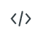
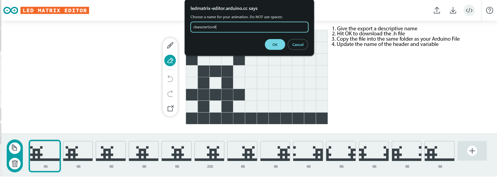

# LED Matrix Editor Guide

## Table of Contents
- [Overview](#overview)
- [Interface](#interface)
- [Project Controls](#project-controls)
- [Canvas Controls](#canvas-controls)
- [Timeline Controls](#timeline-controls)
- [File Types: Saving Your Working File vs Exporting Your Animation](#file-types-saving-your-working-file-vs-exporting-your-animation)
- [Playing and Controlling Your Animation on Your Arduino](#playing-and-controlling-your-animation-on-your-arduino)
- [Example Animations](#example-animations)
- [Animated GIFs](#animated-gifs)

## Overview
The Arduino LED Matrix Editor (https://ledmatrix-editor.arduino.cc/) provides a visual interface for creating LED matrix animations. It allows you to
- Create the animations by painting/erasing pixels frame by frame
- Copying frames to allow easy transitions
- Moving the pixels as a group within a frame
- Setting the display time for each frame

## Interface

## Project Controls
- Start/Stop preview: spacebar
- Start/Stop preview with loop: ⇧ + spacebar
- Upload project: Ctrl + U
- Save project: Ctrl + S
- Export code: Ctrl + E

## Canvas Controls
- Brush: B
- Eraser: E
- Clear frame: ⌘ + ⌫
- Move pixels: ⇧ + arrow keys
- Move pixels with wrap: ⇧ + ⌘ + arrow keys

## Timeline Controls
- New frame: Ctrl + N
- Duplicate frame: Ctrl + D
- Delete frame: Ctrl + ⌫
- Delete all frames: Ctrl + ⇧ + ⌫
- Move between frames: arrow keys

## File Types: Saving Your Working File vs Exporting Your Animation

When using the Matrix Editor it is important to remember that it is a web-based tool, so your work is not automatically saved.

-  Save the current working file as a downloaded **.mpj**
-  Restore a previous session by uploading an **.mpj** file
-  Export the animation as a **.h** file that can be read by Arduino

## Playing and Controlling Your Animation on Your Arduino
There are a few simple steps required to go from the animation you see in the Editor to playing it on the Arduino Matrix:
1. Once you are happy with your animation, press the  button to download your animation as a **.h** code file. This step takes the entire frame sequence and converts it into code that can be understood by Arduino. When you press the button, it will bring up a dialog box. **Choose a name for the file that describes the animation**
- **Do not include any spaces in the file name**

2. Locate the folder that contains your Arduino file
3. Copy the **.h** file you just downloaded into the same folder as your main Arduino file
4. Change the name of the #include to match the name of your file
5. Change the name of the variable referenced by the Animation variable to match your file

### Once you have completed 1 - 5 you can use all functions of TinyFilmFestival to control your animation

## Example Animations
There are a few [Example Animations](exampleAnimations/) here

## Animated GIFs
For your documentation, you can also convert the **.h** files into animated GIFs.

- Go to this [Link](https://npuckett.github.io/gifBuilder/)
- Click the [Choose File] Button
- Click the [Save GIF] Button
- Wait a few seconds. It will generate an animated GIF and download it