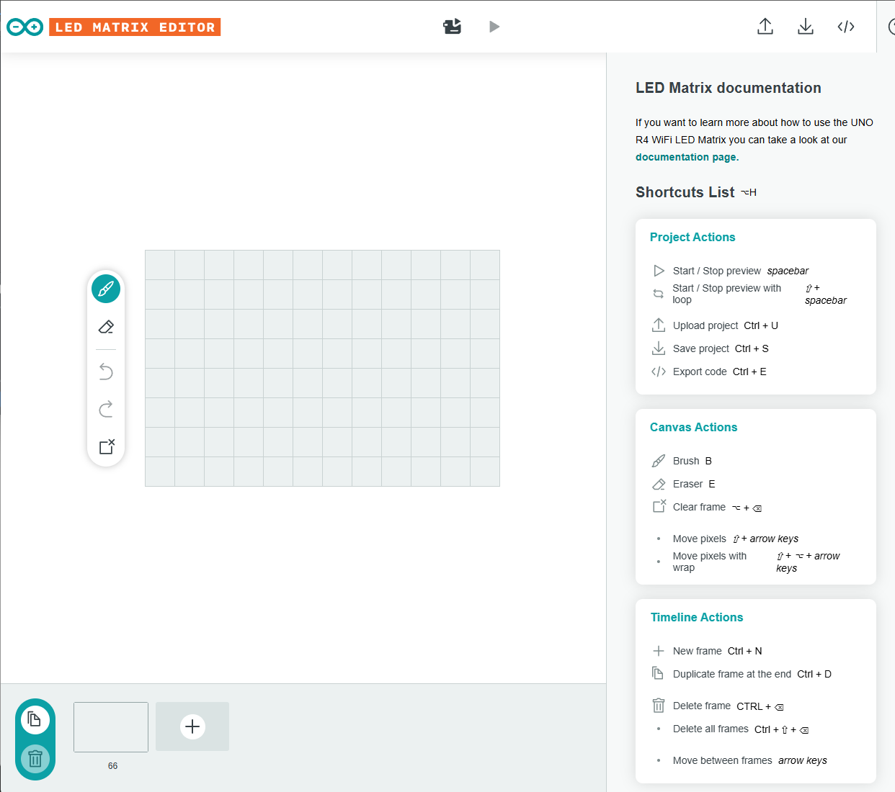
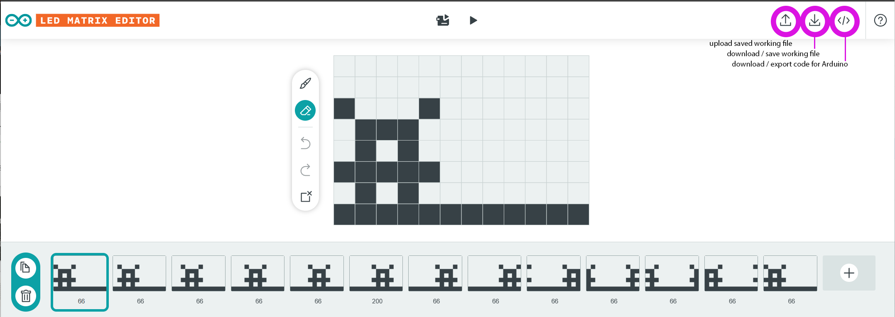
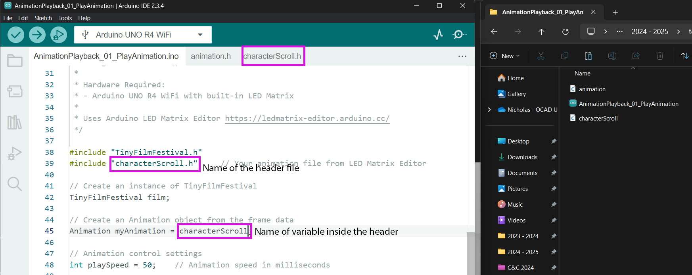

# LED Matrix Editor Guide

The Arduino LED Matrix Editor (https://ledmatrix-editor.arduino.cc/) provides a visual interface for creating LED matrix animations.

## Project Controls
- Start/Stop preview: spacebar
- Start/Stop preview with loop: ⇧ + spacebar
- Upload project: Ctrl + U
- Save project: Ctrl + S
- Export code: Ctrl + E

## Canvas Controls
- Brush: B
- Eraser: E
- Clear frame: ⌘ + ⌫
- Move pixels: ⇧ + arrow keys
- Move pixels with wrap: ⇧ + ⌘ + arrow keys

## Timeline Controls
- New frame: Ctrl + N
- Duplicate frame: Ctrl + D
- Delete frame: Ctrl + ⌫
- Delete all frames: Ctrl + ⇧ + ⌫
- Move between frames: arrow keys

## Saving Your Working File Vs Exporting Your Animation

There are 3 different buttons that are important for Saving , Opening, and Exporting your Animations. 

## Creating Animations
1. Design frames using the 12x8 grid
2. Set frame duration (in milliseconds)
3. Preview animation with spacebar
4. Export code and name it

5. Copy generated code to your project
